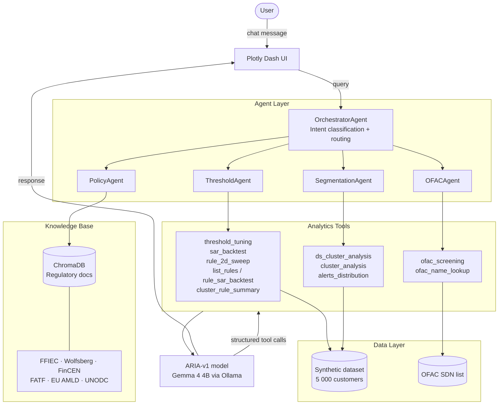

# ARIA-v1 — Agentic Risk Intelligence for AML

An AI-powered Anti-Money Laundering (AML) analytics assistant. ARIA uses a fine-tuned
**Gemma 4 4B** model and an agentic tool-calling architecture to help compliance teams
analyze alert thresholds, segment customers, query regulatory policy, and screen against
sanctions lists — all through a natural language chat interface.

## What it does

| Capability | Description |
|---|---|
| **Threshold tuning** | Sweep FP/FN trade-offs as alert thresholds change across transaction metrics |
| **SAR backtest** | Test how many true SARs a threshold configuration would have caught |
| **2D rule sweep** | Optimize two rule parameters simultaneously with an interactive heatmap |
| **Dynamic segmentation** | Cluster customers into behavioral profiles using K-Means |
| **AML policy Q&A** | Ask compliance questions answered from a regulatory knowledge base |
| **OFAC screening** | Screen customer portfolio against the SDN sanctions list |

## Architecture



All analytics are **pre-computed in Python** — the model copies verbatim numbers into its
response, which eliminates hallucinated figures.

## Model

ARIA-v1 is fine-tuned from [`google/gemma-3-4b-it`](https://huggingface.co/google/gemma-3-4b-it)
on 933 domain-specific AML examples using supervised fine-tuning (SFT) with Unsloth.

The model learns to:
- Classify user intent and route to the correct analytics agent
- Call Python analytics functions with correctly structured parameters
- Copy pre-computed results verbatim and add a single AML domain insight
- Answer definitional and policy questions without hallucinating citations or numbers

Training data versioned in `finetune/data/` — the latest is `aria_train_combined_v38_full.jsonl`.

## Dataset

Fully synthetic dataset of 5,000 customer accounts covering:
- Transaction behavior metrics (avg weekly transactions, avg amount, monthly volume)
- Alert flags, false positive / false negative labels
- Simulated SAR outcomes across Business and Individual segments
- K-Means behavioral cluster assignments

No real customer data. All IDs are UUIDs generated at build time.

## Tech stack

- **LLM**: ARIA-v1 (Gemma 4 4B, Q8 GGUF) via Ollama
- **UI**: Plotly Dash + dash-bootstrap-components
- **Analytics**: pandas, scikit-learn, Plotly
- **Knowledge base**: ChromaDB + sentence-transformers (`all-MiniLM-L6-v2`)
- **Regulatory docs**: FFIEC, Wolfsberg, FinCEN, FATF, EU 4th/5th/6th AMLD, AMLR 2024, UNODC
- **Training**: Unsloth SFT on vast.ai (RTX 3090 / RTX 4090)

## Running locally

```bash
# 1. Install dependencies
pip install -r requirements.txt

# 2. Pull and serve the model via Ollama
ollama pull aria-v1   # or point OLLAMA_MODEL to your local GGUF

# 3. (Optional) Build the regulatory knowledge base
python ingest.py

# 4. Start the app
python application.py
```

Environment variables (all optional — defaults shown):

```
OLLAMA_BASE_URL=http://localhost:11434/v1
OLLAMA_MODEL=aria-v1
ARIA_DATA_DIR=./aria_synth        # path to your customer data CSV folder
```

## License

This repository uses a dual-licensing structure:

**Source code** (`agents/`, `application.py`, tools, scripts) — [Apache 2.0](LICENSE)
Free to use, modify, and distribute for any purpose.

**Model weights and training data** (`finetune/data/`) — [Modified OpenRAIL-M](LICENSE_MODEL)
Free for personal use, academic research, and organizations with annual revenue
and total funding each below **USD $2 million**. Commercial use above that threshold
requires a separate license. The model may not be used to build a competing
AML transaction monitoring or financial crime analytics product or service.

For commercial licensing enquiries, open an issue in this repository.
